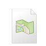
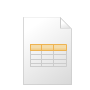
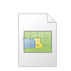
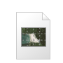
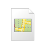
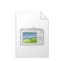
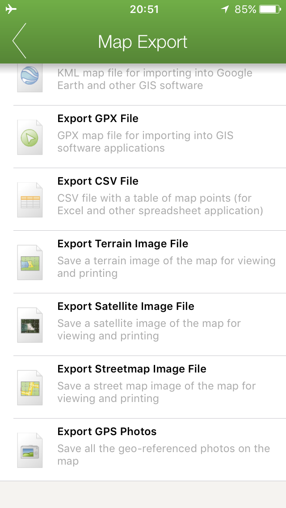

..  export_map

Export Options
================
  
.. image:: /screenshots/export_map.png
  :width: 200px
  
Send Map As Email
-----------------
Send map as an email message. The map is attached in multiple formats (gpx, xml, csv, fire mapper & jpg). 
A satellite and terrain image of the map are attached for users to view without any additional mapping software.

Upload Map
----------
Upload map directly to your organisation. This feature requires an organisational licence.

Export FireMap File
-------------------
Exports a FireMap File (xml) containing all the information stored on the map (except photos). 
This format is useful for transferring maps to other devices running FireMapper. (This file format may be discontinued)

Export KML/KMZ File
---------------
Exports the map as a KML/KMZ file. This format is used by most GIS applications including Google Earth. 

.. note:: FireMapper tries to format kml maps with similar line styles, however some line styles can not be reproduced in KML. The KML/KMZ format only supports solid lines. Dotted, dashed or other line styles are not supported. This is a limitation of the KML/KMZ format, not FireMapper.

Export GPX File
------------------
Exports the map as a GPX file. This format is used by most GIS applications.

Export CSV File
-------------------
Exports all the points on the map as a CSV file. This format can be opened in most spreadsheet applications 
including Microsoft Excel, Open Office and Google Spreadsheets.

Export Image file
-----------------

Export GPS Photos (*.jpg)
-------------------------

