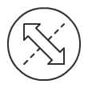

..  feature_toolbar

Feature Toolbar
================

The feature toolbar appears at the bottom of the map whenever a point or line is selected on the map. The options that appear in the bar are dependent on the selected feature type.

Send As Email Button
--------------------
 
Sends the selected feature as a text message. The text message includes a screenshot of the map and any GPS photos that are attached to the selected feature.

Send As Text Button
-------------------

Sends the selected feature as a text message. The text message includes a screenshot of the map and any GPS photos that are attached to the selected feature.

Delete Feature Button
---------------------
Deletes the selected point or line from the map. This option is available for all features

Downgrade Feature Button
-------------------------
Changes the selected point or line to a proposed/unconfirmed state.

.. note:: This option is only available for some features

Upgrade Feature Button
-----------------------
Changes the selected point or line to a unconfirmed/confirmed state.

.. note:: This option is only available for some features

Rotate Point Button
--------------------

Rotate the selected point by 45 degrees. This option is only available for points that support rotation (such as fire direction and wind direction).

.. image:: symbols/
  :width: 50px 
  :height: 50px

Flip Line Button
-----------------

Flip the selected line style. 

.. note:: This option is only available for asymmetrical lines such as control line and blackburn styles.

