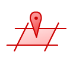
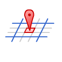
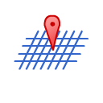

Location Search
======================================

Location Search is an intelligent search field that allows users to search for a location using one of the following formats:

Address
-------

* Street Address (e.g. 1 Darley Rd, Manly)
* Suburb (e.g. Manly)
* Intersection (e.g. Darley Rd Marshall St)
* State & Postcode (e.g. 2095 NSW)

.. note::
   The address based search requires an internet connect to work. Unlike the grid reference based searches it is not available offline.

Four Figure Grid Reference
--------------------------

Returns a list of the nearby matching four figure grid reference locations based on the users current location. As four figure grid references repeat every 100km, results are limited to up to 9 locations.
A four figure grid reference has a low accuracy of 1km by 1km.

* 3449
* 34 49
* 34-49
* GR3449

  
.. note::
  The grid reference search requires your current location in order to display matching grid references near your location.
  
Six Figure Grid Reference
-------------------------

Returns a list of the nearby matching six figure grid reference locations based on the users current location.
A six figure grid reference has a medium accuracy of 100m by 100m.

* 342492
* 342 492
* 342-492
* GR342492

  
.. note::
 The grid reference search requires your current location in order to display matching grid references near your location.
  
Fourteen Figure Grid Reference
------------------------------

Returns a list of the nearby matching fourteen figure grid reference locations based on the users current location.
A fourteen figure grid reference has a high accuracy of 1m by 1m.

* 03424926257387
* 0342492 6257387
* 0342492-6257387
* GR0342492 6257387

  
.. note::
   The grid reference search requires your current location in order to display matching grid references near your location.
  
Grid Reference
----------------

You can also search by grid reference with the UTM Zone and 100km diagraph.
 
* 56H LH 424 573
* 56H LH 424573
* 56HLH424573

where 56 is the UTM zone number, H is the UTM zone letter and LH is the 100km diagraph in this example
If you don’t provide the UTM Zone, a list of the nearby matching locations will be returned based on your current location.

* LH 424 573
* LH 424573
* LH424573

where LH is the 100km diagraph in this example

Decimal Degrees (DD): 
---------------------
Latitude/Longitude expressed in decimal degrees.

* -33.81200 151.2987
* 33.81200S 151.2987W
* S33.81200 W151.2987

.. image:: /symbols/latLng.png
  :width: 60px
  
Degrees Minutes (DM):
-----------------------
Latitude/Longitude expressed in degree minutes.

* -33 48 151 17
* 33 48S 151 17W
* S33 48 W151 17
* -33 48.72 151 17.89
* 33 48.72S 151 17.89W
* S33 48.72 W151 17.89

.. image:: /symbols/latLng.png
  :width: 60px
  
Degrees Minutes Seconds (DMS):
-------------------------------
Latitude/Longitude expressed in degree minute seconds.

* -33 48 15 151 17 22
* 33 48 15S 151 17 22W
* S33 48 15 W151 17 22
* -33 48 15.11 151 17 22.34
* 33 48 15.11S 151 22.34W
* S33 48 15.11 W151 22.34
 
.. image:: /symbols/latLng.png
  :width: 60px

UTM Reference
-------------
A UTM reference has a high accuracy of 1m x 1m.

* 56H 342492 6257387

